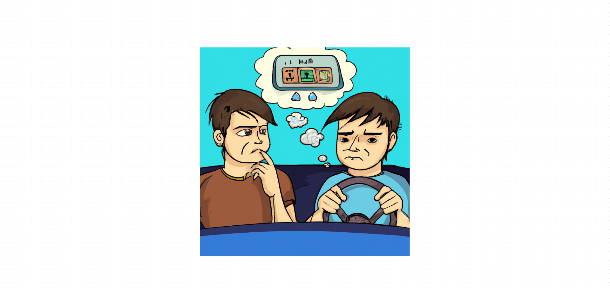

# The Mathematics of the Playlist

My brother called and told me that he was almost there and that I should come down to save time. It was Friday, end of the day and we were getting ready to go to the coast. As soon as I got into the car, he asked me to put on the new CD that he had bought. It had 100 songs and was supposed to last the whole trip and still have some left.

He suggested that I select the "random" mode, but frustrated, he made the following comment:

"The random on this radio is broken!"
"What do you mean, broken?" I said.
"Well, you'll see, in a minute it's going to repeat a song."
"Well, and so, the random doesn't guarantee that the songs won't repeat. Have you tried the "sequential" mode?" I replied ironically.
"Dude, there are 100 songs on the CD, every time I go to the office I end up hearing a repeated song on the way."

I was intrigued by the comment, and even more intrigued by my brother's musical taste, but after all, it was his car. As an escape from the musical hell I was exposed to, my brain quickly found solace in Platonic mathematical abstractions, a mental hygiene.

Deep down I doubted that the random mode was broken since it is so easy to implement computationally. I tried to model the problem so I could treat it, I assumed that the random mode in this case is equivalent to rolling a 100-sided die every time to define the song that will be played. Of course, at some point repeats will happen, but the question was, when?

Mathematically, what I was seeking was to answer what was the expected number of songs to listen to until there is a first repetition. In statistics, this concept has a curious name, it is called "Expectation".

The concept of Expectation has a strong relationship with the average, for example, suppose my brother recorded how many songs he heard until the first repetition each time he went to the office (assuming that there is always time for some repetition to occur, which is not true). The average of this value is close to the expected value we are looking for.

He could tabulate the values as shown in the table below. Suppose he heard the CD 1000 times, then the table would look something like this.

| number of tracks listened to until first repetition | number of times that happens |
| --- | --- |
| 1 | 3 |
| 2 | 5 |
| 3 | 8 |
| 4 | 12 |
| … | … |
| 100 | 0 |
| Total | 1000 |

Formally, this value should be close to the expression below where P(x) means the probability that x occurs:

1 x P(1 song without repetition) + 2 x P(2 songs without repetition) + ... + 100 x P(100 songs without repetition)

The patient reader will note that calculating the arithmetic mean of how many songs until the first repetition of the table is close to the Platonic concept of "Expectation" given in terms of probabilities. The remaining question is how to calculate the probabilities. To help the reasoning, let's calculate the probability of listening to exactly 4 non-repeated songs, that is, the repetition will necessarily occur on the fifth song.

$$
1 \times \frac{99}{100} \times \frac{98}{100} \times \frac{97}{100} \times \frac{4}{100}
$$

Which is equivalent to:

$$
\frac{100!}{96! \times 100^5} \times 4
$$

Converting the values to a general form we will have:

$$
\frac{n!}{(n-k)!n^{k+1}} k
$$

where n = 100 and k = 4

Finally, rebuilding the formula above in terms of the results obtained above, we will have:

$$
\sum_{k=0}^{n} \frac{k^2n!}{n^{k+1}(n-k)!}
$$

I haven't been able to find a closed form yet, that is, I haven't been able to get rid of the sum in the formula, meaning that I'll need to use computational power. Fortunately, the reader will be able to use the widget I created to calculate the expected number of songs based on the total number of CDs.

[Número esperado de músicas não repetidas](https://www.wolframalpha.com/widgets/view.jsp?id=4c9275ff58db0cd1e8e109ebba378031)

For example, my brother was surprised to learn that for his CD this number is 12, which means that, considering an average of 3 minutes per song, the first repetition is expected to occur 36 minutes later.

Indeed, with the traffic in São Paulo on Friday night, we heard the first repetition before we reached Imigrantes, where I was woken from my mathematical trance by my brother's disproportionately shrill shout:

"Aha! I told you, the randomness is broken!!!!"